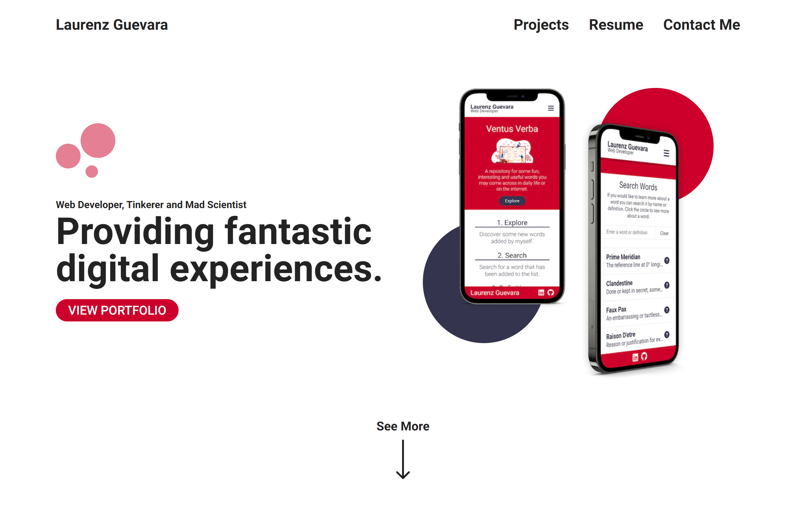

<div style="text-align: center;">
    
</div>

## Getting Started

Node Version v18.13.0

1. Clone the repo

    ```bash
    git clone https://github.com/Laurenz-Guevara/laurenz-guevara-portfolio-next-tailwind.git
    ```

2. Install Packages

    ```bash
    npm install
    ```
    
3. Run a Build

    ```bash
    npm run build
    ```

4. Start the App

    ```bash
    npm run dev
    ```
